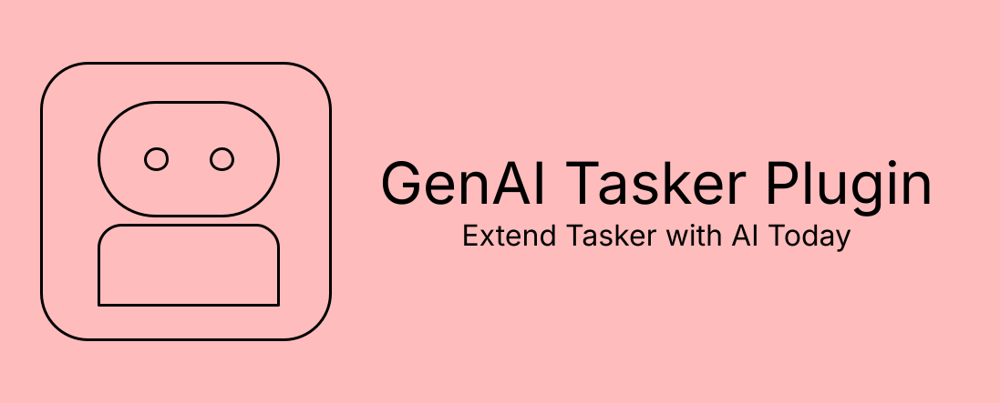

# GenAI Tasker Plugin

### Antivirus Warning 
Some antivirus programs may flag this app as potentially harmful. This is a known issue that can occur with automation tools, plugins, or apps that use dynamic code execution or network APIs.

GenAI Tasker Plugin is fully open-source, and you are encouraged to review the code yourself.

There is no malicious functionality included in this project. However, if you are uncomfortable installing the app, you should trust your judgment and avoid doing so.

<hr>

A versatile Android plugin for [Tasker](https://play.google.com/store/apps/details?id=net.dinglisch.android.taskerm) that allows you to integrate various Generative AI models into your automation workflows.

## Features

- **Multiple Providers**: Support for OpenAI, Google Gemini, Anthropic Claude, OpenRouter, xAI (Grok), and local Ollama instances.
- **Vision Support**: Upload local images or use Tasker variables containing image URIs for multi-modal interactions.
- **Customizable**: Override default models and API base URLs (perfect for local proxies or self-hosted LLMs).
- **Flexible Input**:
  - **Manual Mode**: Build conversations directly in the Tasker UI.
  - **Variable/JSON Mode**: Pass dynamic message arrays or raw text using Tasker variables.
- **Tasker Integration**: Seamlessly returns AI responses to Tasker variables (default: `%ai_response`).

## Supported Providers

### OpenAI

```text
Provider: OpenAI
Default Model: gpt-4o-mini
Custom Base URL: Yes

Description:
OpenAI provides powerful general-purpose language models optimized for chat,
reasoning, coding, and multimodal tasks.
```

### Gemini

```text
Provider: Gemini (Google)
Default Model: gemini-1.5-flash
Custom Base URL: Yes

Description:
Gemini offers fast, multimodal AI models with strong performance for
real-time applications and large context windows.
```

### Claude

```text
Provider: Claude (Anthropic)
Default Model: claude-3-5-sonnet-20240620
Custom Base URL: Yes

Description:
Claude excels at long-context reasoning, writing, and complex analytical tasks
with a strong emphasis on safety and reliability.
```

### OpenRouter

```text
Provider: OpenRouter
Default Model: google/gemini-flash-1.5
Custom Base URL: Yes

Description:
OpenRouter provides a unified API for accessing models from multiple AI
providers through a single endpoint.
```

### xAI (Grok)

```text
Provider: xAI (Grok)
Default Model: grok-2-latest
Custom Base URL: Yes

Description:
Grok is a conversational AI model focused on fast responses and strong
general-purpose reasoning capabilities.
```

### Ollama

```text
Provider: Ollama
Default Model: llama3
Custom Base URL: Yes (Required for localhost)

Description:
Ollama runs AI models locally, enabling private, offline, and self-hosted
language model deployments.
```

## Installation

1. Download and install the APK.
2. Open **Tasker**.
3. Create a new **Action**.
4. Go to **Plugin** -> **GenAI Tasker Plugin** -> **AI Action**.
5. Tap the **Configuration** (pencil) icon to set up your request.

## Configuration

### 1. Basic Setup
- **Provider**: Select your preferred AI service.
- **API Key**: Enter your secret key (not required for Ollama if running locally).
- **Model**: (Optional) Specify a specific model ID (e.g., `gpt-4o`, `claude-3-opus`, `grok-2-latest`).
- **Base URL**: (Optional) Provide a custom endpoint (e.g., `http://192.168.1.10:11434` for Ollama).

### 2. Images (Vision)
- **Image URI**: Provide a local file path (e.g., `/sdcard/Pictures/photo.jpg`) or a Tasker variable like `%image_path`. The plugin will Base64 encode the image and attach it to the prompt.

### 3. Messages
- **Manual Messages**: Add multiple roles (System, User, Assistant) to build a conversation history.
- **Variable / JSON**: Toggle to this tab to pass a raw string or a JSON array of messages (e.g., `[{"role": "user", "content": "Hello!"}]`).

## Variables Returned

- `%ai_response`: The text content of the AI's reply.
- `%ai_raw_json`: (Optional) The full raw JSON response from the provider for advanced parsing.

## Requirements

- Android 8.0+
- Tasker installed and configured.
- Active internet connection (unless using local Ollama).

## Development

Built with Kotlin and uses the [Tasker Plugin Library](https://github.com/joaomgcd/TaskerPluginLibrary).

### Build
```bash
./gradlew assembleDebug

## License

MIT License - feel free to use and modify for your own automation needs!
